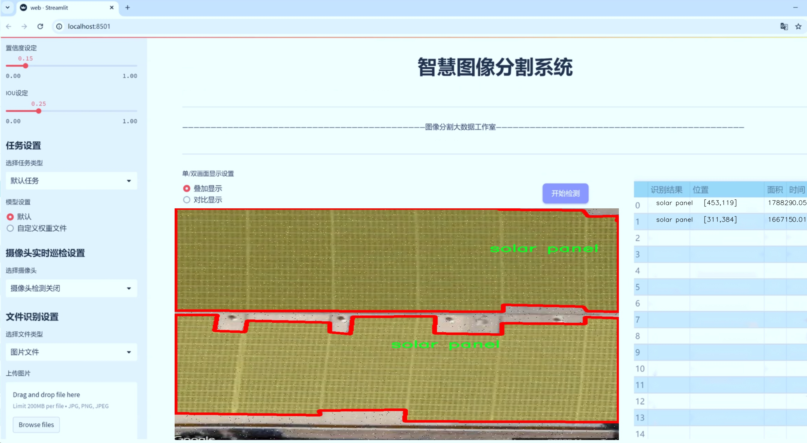
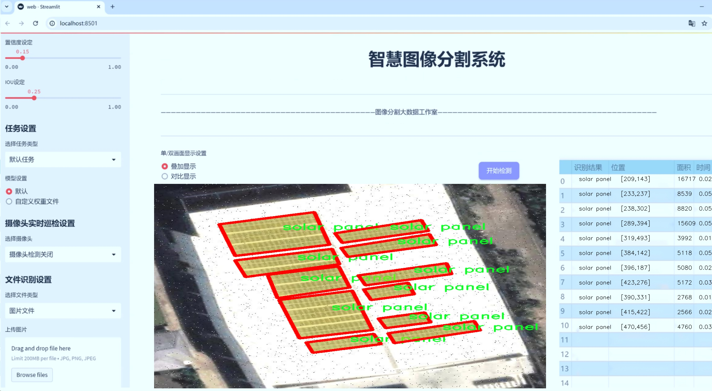
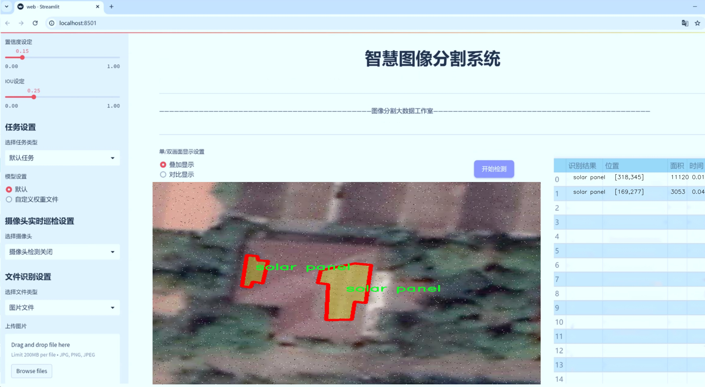
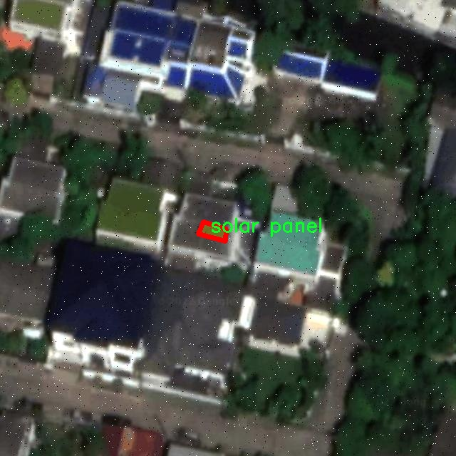
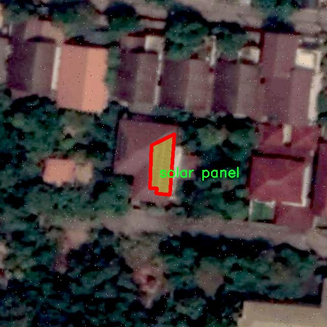
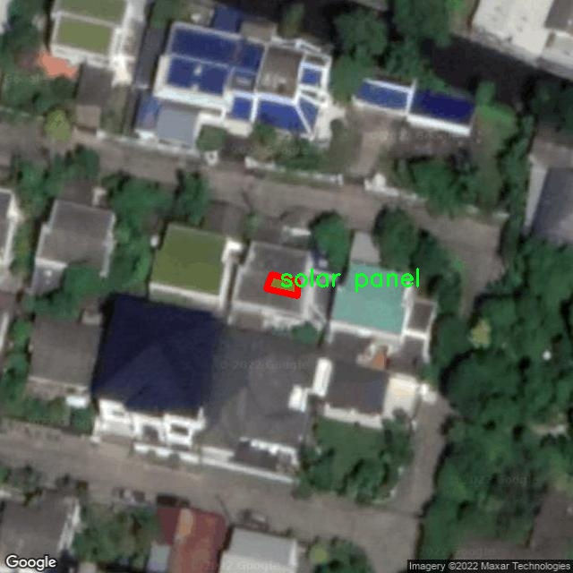
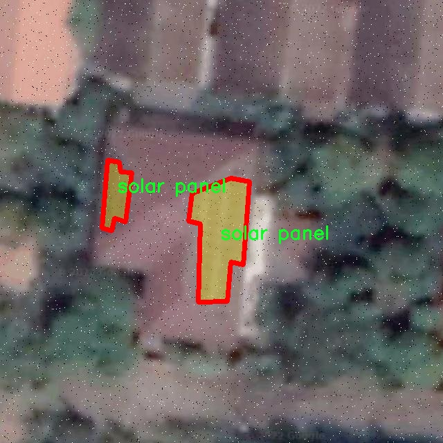
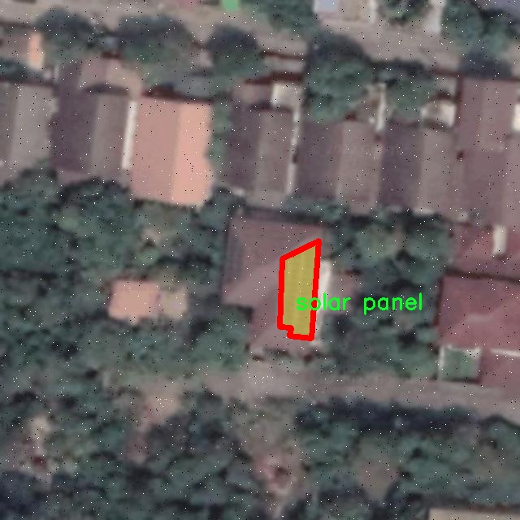

# 太阳能面板分割系统源码＆数据集分享
 [yolov8-seg-C2f-REPVGGOREPA＆yolov8-seg-C2f-OREPA等50+全套改进创新点发刊_一键训练教程_Web前端展示]

### 1.研究背景与意义

项目参考[ILSVRC ImageNet Large Scale Visual Recognition Challenge](https://gitee.com/YOLOv8_YOLOv11_Segmentation_Studio/projects)

项目来源[AAAI Global Al lnnovation Contest](https://kdocs.cn/l/cszuIiCKVNis)

研究背景与意义

随着全球对可再生能源的日益重视，太阳能作为一种清洁、可再生的能源形式，得到了广泛的应用和推广。太阳能面板的安装和维护是确保其高效运行的关键，而面板的分割与识别则是实现自动化监测和维护的重要步骤。近年来，深度学习技术在计算机视觉领域取得了显著进展，尤其是目标检测和实例分割方面。YOLO（You Only Look Once）系列模型因其高效性和实时性而受到广泛关注，成为了许多实际应用中的首选。然而，现有的YOLOv8模型在处理复杂背景和多种类目标时，仍然面临着准确性和鲁棒性不足的问题。因此，基于改进YOLOv8的太阳能面板分割系统的研究具有重要的理论和实践意义。

本研究基于PVseg数据集，该数据集包含3000张高分辨率的太阳能面板图像，涵盖了6个类别和7个类标签，包括PV-Panel、solar panel、solar-panel、solar-panels和solar-pv-panel等。这些图像的多样性和复杂性为模型的训练提供了丰富的样本，有助于提高模型的泛化能力和准确性。通过对这些图像进行实例分割，不仅可以精确识别和定位太阳能面板，还可以为后续的性能评估和故障检测提供基础数据支持。

在实际应用中，太阳能面板的分割与识别不仅涉及到面板的数量统计，还包括对面板状态的监测和故障的早期预警。通过高效的分割系统，能够实现对太阳能发电系统的智能化管理，降低人工巡检的成本，提高运维效率。此外，随着智能城市和智慧能源的快速发展，基于图像识别的太阳能面板监测系统也将为未来的能源管理提供新的解决方案。

改进YOLOv8模型的研究，不仅可以推动计算机视觉技术在太阳能领域的应用，还可以为其他领域的目标检测和实例分割提供借鉴。通过优化模型结构、调整超参数和引入新的数据增强技术，期望能够显著提升模型在复杂环境下的表现。同时，研究还将探讨如何利用迁移学习和集成学习等方法，进一步提高模型的准确性和鲁棒性。

综上所述，基于改进YOLOv8的太阳能面板分割系统的研究，不仅具有重要的学术价值，还有助于推动太阳能行业的智能化发展，促进可再生能源的高效利用。通过深入探索这一领域的技术创新，期望为实现更高效、更智能的能源管理体系贡献力量，为全球可持续发展目标的实现提供支持。

### 2.图片演示







##### 注意：由于此博客编辑较早，上面“2.图片演示”和“3.视频演示”展示的系统图片或者视频可能为老版本，新版本在老版本的基础上升级如下：（实际效果以升级的新版本为准）

  （1）适配了YOLOV8的“目标检测”模型和“实例分割”模型，通过加载相应的权重（.pt）文件即可自适应加载模型。

  （2）支持“图片识别”、“视频识别”、“摄像头实时识别”三种识别模式。

  （3）支持“图片识别”、“视频识别”、“摄像头实时识别”三种识别结果保存导出，解决手动导出（容易卡顿出现爆内存）存在的问题，识别完自动保存结果并导出到tempDir中。

  （4）支持Web前端系统中的标题、背景图等自定义修改，后面提供修改教程。

  另外本项目提供训练的数据集和训练教程,暂不提供权重文件（best.pt）,需要您按照教程进行训练后实现图片演示和Web前端界面演示的效果。

### 3.视频演示

[3.1 视频演示](https://www.bilibili.com/video/BV1bJC2YZEtJ/)

### 4.数据集信息展示

##### 4.1 本项目数据集详细数据（类别数＆类别名）

nc: 1
names: ['solar panel']


##### 4.2 本项目数据集信息介绍

数据集信息展示

在本研究中，我们使用了名为“PVseg - High Zoom - NL - v3”的数据集，以训练和改进YOLOv8-seg模型，旨在实现高效的太阳能面板分割系统。该数据集专注于太阳能面板的图像数据，具有极高的放大倍数，能够提供清晰、详细的图像信息，适合进行精确的分割任务。数据集的设计初衷是为了满足在复杂环境中对太阳能面板进行准确识别和分割的需求，尤其是在城市和乡村等多样化的场景中。

“PVseg - High Zoom - NL - v3”数据集包含了丰富的图像样本，专注于单一类别的对象——太阳能面板。该数据集的类别数量为1，类别列表中仅包含“solar panel”。这种单一类别的设置使得模型能够专注于学习太阳能面板的特征，减少了多类别间的干扰，从而提高了分割的准确性和效率。数据集中包含的图像均为高分辨率，确保了在进行分割时，模型能够捕捉到太阳能面板的细微特征，包括边缘、纹理和光照变化等。

在数据集的构建过程中，研究团队采用了高质量的图像采集技术，确保了每一张图像的清晰度和真实性。数据集中的图像不仅涵盖了不同角度和光照条件下的太阳能面板，还考虑了不同背景环境的复杂性，这对于模型的泛化能力至关重要。通过在多样化的场景中进行训练，YOLOv8-seg模型能够更好地适应实际应用中的各种情况，提高了在真实环境中部署的可行性。

此外，数据集还经过了精细的标注处理，每个太阳能面板都被准确地框定，确保了训练数据的高质量。这种精确的标注不仅为模型提供了清晰的学习目标，也为后续的评估和验证提供了可靠的依据。在训练过程中，模型将通过不断迭代学习，逐步优化其对太阳能面板的识别和分割能力，最终实现高效、准确的分割效果。

为了进一步提升模型的性能，研究团队还计划在数据集的基础上进行数据增强，包括旋转、缩放、翻转等操作，以增加训练样本的多样性。这将有助于提高模型的鲁棒性，使其在面对不同环境和条件时，依然能够保持良好的分割效果。

总之，“PVseg - High Zoom - NL - v3”数据集为改进YOLOv8-seg的太阳能面板分割系统提供了坚实的基础。通过高质量的图像和精确的标注，该数据集不仅为模型的训练提供了丰富的素材，也为后续的研究和应用奠定了良好的基础。随着模型的不断优化和数据集的进一步扩展，我们期待能够在太阳能面板的自动识别和分割领域取得更大的突破，为可再生能源的推广和应用贡献力量。











### 5.全套项目环境部署视频教程（零基础手把手教学）

[5.1 环境部署教程链接（零基础手把手教学）](https://www.bilibili.com/video/BV1jG4Ve4E9t/?vd_source=bc9aec86d164b67a7004b996143742dc)


[5.2 安装Python虚拟环境创建和依赖库安装视频教程链接（零基础手把手教学）](https://www.bilibili.com/video/BV1nA4VeYEze/?vd_source=bc9aec86d164b67a7004b996143742dc)

### 6.手把手YOLOV8-seg训练视频教程（零基础小白有手就能学会）

[6.1 手把手YOLOV8-seg训练视频教程（零基础小白有手就能学会）](https://www.bilibili.com/video/BV1cA4VeYETe/?vd_source=bc9aec86d164b67a7004b996143742dc)


按照上面的训练视频教程链接加载项目提供的数据集，运行train.py即可开始训练



     Epoch   gpu_mem       box       obj       cls    labels  img_size
     1/200     0G   0.01576   0.01955  0.007536        22      1280: 100%|██████████| 849/849 [14:42<00:00,  1.04s/it]
               Class     Images     Labels          P          R     mAP@.5 mAP@.5:.95: 100%|██████████| 213/213 [01:14<00:00,  2.87it/s]
                 all       3395      17314      0.994      0.957      0.0957      0.0843

     Epoch   gpu_mem       box       obj       cls    labels  img_size
     2/200     0G   0.01578   0.01923  0.007006        22      1280: 100%|██████████| 849/849 [14:44<00:00,  1.04s/it]
               Class     Images     Labels          P          R     mAP@.5 mAP@.5:.95: 100%|██████████| 213/213 [01:12<00:00,  2.95it/s]
                 all       3395      17314      0.996      0.956      0.0957      0.0845

     Epoch   gpu_mem       box       obj       cls    labels  img_size
     3/200     0G   0.01561    0.0191  0.006895        27      1280: 100%|██████████| 849/849 [10:56<00:00,  1.29it/s]
               Class     Images     Labels          P          R     mAP@.5 mAP@.5:.95: 100%|███████   | 187/213 [00:52<00:00,  4.04it/s]
                 all       3395      17314      0.996      0.957      0.0957      0.0845


### 7.50+种全套YOLOV8-seg创新点代码加载调参视频教程（一键加载写好的改进模型的配置文件）

[7.1 50+种全套YOLOV8-seg创新点代码加载调参视频教程（一键加载写好的改进模型的配置文件）](https://www.bilibili.com/video/BV1Hw4VePEXv/?vd_source=bc9aec86d164b67a7004b996143742dc)

### 8.YOLOV8-seg图像分割算法原理

原始YOLOv8-seg算法原理

YOLOv8-seg算法是YOLO系列中的最新进展，旨在实现高效的目标检测与分割任务。与其前身YOLOv5相比，YOLOv8在检测精度和速度上都有显著提升。该算法的设计不仅关注于目标检测的准确性，还特别强调了对目标的精细分割能力，适应了多种应用场景的需求。YOLOv8-seg的网络结构主要由输入端、骨干网络、颈部网络和头部网络四个部分组成，每个部分在整体架构中发挥着不可或缺的作用。

在输入端，YOLOv8-seg通过马赛克数据增强、自适应锚框计算和自适应灰度填充等技术，对输入图像进行预处理。这些技术不仅提升了模型对不同场景的适应能力，还增强了模型在复杂背景下的鲁棒性。马赛克数据增强能够有效增加训练样本的多样性，帮助模型更好地学习到目标的特征。自适应锚框计算则通过动态调整锚框的尺寸和比例，提升了对不同目标尺度的检测能力，而自适应灰度填充则确保了输入图像在不同尺寸下的统一性，避免了信息损失。

骨干网络是YOLOv8-seg的核心部分，采用了C2f模块和SPPF结构。C2f模块的设计灵感来源于YOLOv7的ELAN结构，通过引入更多的分支和跨层连接，显著增强了梯度流动，使得模型在特征学习过程中能够捕捉到更丰富的信息。SPPF结构则通过空间金字塔池化的方式，提取不同尺度的特征，有效减少了模型的参数量和计算量，同时提升了特征提取的效率。这种设计使得YOLOv8-seg在处理复杂场景时，能够更好地识别和分割目标。

颈部网络采用了路径聚合网络（PAN）结构，这一结构通过上下采样和特征拼接的方式，有效融合了不同尺度的特征图。PAN的设计使得模型能够在不同的尺度上对目标进行精确的定位和分割，尤其是在面对小目标时，能够显著提升模型的感知能力。通过这种特征融合，YOLOv8-seg能够更好地处理多样化的目标形态和复杂的背景信息。

头部网络是YOLOv8-seg的输出部分，其设计上实现了分类和检测过程的解耦。与传统的耦合头结构不同，YOLOv8-seg采用了解耦头结构，这一结构能够独立处理分类和回归任务，从而提高了模型的灵活性和准确性。在损失计算方面，YOLOv8-seg引入了Task-Aligned Assigner策略，通过对分类与回归分数的加权，优化了正负样本的匹配过程。这一策略使得模型在训练过程中能够更有效地学习到目标的特征，进而提升了检测和分割的精度。

在损失函数的选择上，YOLOv8-seg结合了二元交叉熵损失（BCELoss）和分布焦点损失（DFLoss），以提升模型对边界框预测的精准性。同时，完全交并比损失函数（CIOULoss）也被纳入损失计算中，以增强模型在边界处理上的能力。这些损失函数的组合使得YOLOv8-seg在目标检测和分割任务中表现出色，能够在复杂环境下实现高效的目标识别与分割。

值得注意的是，YOLOv8-seg在处理小目标时，特别针对小目标的漏检问题，设计了更小的检测头，以提升网络对小目标的感知能力。这一改进使得YOLOv8-seg在面对复杂水面环境等场景时，能够有效降低定位误差，提高目标检测的准确性。此外，YOLOv8-seg还引入了GSConv和Slim-neck技术，以保持模型的精度并降低计算量，从而实现了更高效的实时检测与分割。

综上所述，YOLOv8-seg算法通过对网络结构的优化与创新，结合了高效的特征提取、精确的目标检测与分割能力，展现了其在复杂场景下的强大适应性与鲁棒性。其独特的设计理念和先进的技术手段，使得YOLOv8-seg不仅在学术研究中具有重要的理论价值，也在实际应用中展现出广泛的应用前景。随着YOLOv8-seg的不断发展与完善，未来有望在更多领域中发挥重要作用，为智能视觉系统的构建提供更为强大的技术支持。


### 9.系统功能展示（检测对象为举例，实际内容以本项目数据集为准）

图9.1.系统支持检测结果表格显示

  图9.2.系统支持置信度和IOU阈值手动调节

  图9.3.系统支持自定义加载权重文件best.pt(需要你通过步骤5中训练获得)

  图9.4.系统支持摄像头实时识别

  图9.5.系统支持图片识别

  图9.6.系统支持视频识别

  图9.7.系统支持识别结果文件自动保存

  图9.8.系统支持Excel导出检测结果数据


### 10.50+种全套YOLOV8-seg创新点原理讲解（非科班也可以轻松写刊发刊，V11版本正在科研待更新）

#### 10.1 由于篇幅限制，每个创新点的具体原理讲解就不一一展开，具体见下列网址中的创新点对应子项目的技术原理博客网址【Blog】：


[10.1 50+种全套YOLOV8-seg创新点原理讲解链接](https://gitee.com/qunmasj/good)

#### 10.2 部分改进模块原理讲解(完整的改进原理见上图和技术博客链接)【如果此小节的图加载失败可以通过CSDN或者Github搜索该博客的标题访问原始博客，原始博客图片显示正常】

### Gold-YOLO简介
YOLO再升级：华为诺亚提出Gold-YOLO，聚集-分发机制打造新SOTA
在过去的几年中，YOLO系列模型已经成为实时目标检测领域的领先方法。许多研究通过修改架构、增加数据和设计新的损失函数，将基线推向了更高的水平。然而以前的模型仍然存在信息融合问题，尽管特征金字塔网络（FPN）和路径聚合网络（PANet）已经在一定程度上缓解了这个问题。因此，本研究提出了一种先进的聚集和分发机制（GD机制），该机制通过卷积和自注意力操作实现。这种新设计的模型被称为Gold-YOLO，它提升了多尺度特征融合能力，在所有模型尺度上实现了延迟和准确性的理想平衡。此外，本文首次在YOLO系列中实现了MAE风格的预训练，使得YOLO系列模型能够从无监督预训练中受益。Gold-YOLO-N在COCO val2017数据集上实现了出色的39.9% AP，并在T4 GPU上实现了1030 FPS，超过了之前的SOTA模型YOLOv6-3.0-N，其FPS相似，但性能提升了2.4%。


#### Gold-YOLO


YOLO系列的中间层结构采用了传统的FPN结构，其中包含多个分支用于多尺度特征融合。然而，它只充分融合来自相邻级别的特征，对于其他层次的信息只能间接地进行“递归”获取。

传统的FPN结构在信息传输过程中存在丢失大量信息的问题。这是因为层之间的信息交互仅限于中间层选择的信息，未被选择的信息在传输过程中被丢弃。这种情况导致某个Level的信息只能充分辅助相邻层，而对其他全局层的帮助较弱。因此，整体上信息融合的有效性可能受到限制。
为了避免在传输过程中丢失信息，本文采用了一种新颖的“聚集和分发”机制（GD），放弃了原始的递归方法。该机制使用一个统一的模块来收集和融合所有Level的信息，并将其分发到不同的Level。通过这种方式，作者不仅避免了传统FPN结构固有的信息丢失问题，还增强了中间层的部分信息融合能力，而且并没有显著增加延迟。


# 8.低阶聚合和分发分支 Low-stage gather-and-distribute branch
从主干网络中选择输出的B2、B3、B4、B5特征进行融合，以获取保留小目标信息的高分辨率特征。


低阶特征对齐模块 (Low-stage feature alignment module)： 在低阶特征对齐模块（Low-FAM）中，采用平均池化（AvgPool）操作对输入特征进行下采样，以实现统一的大小。通过将特征调整为组中最小的特征大小（ R B 4 = 1 / 4 R ） （R_{B4} = 1/4R）（R 
B4 =1/4R），我们得到对齐后的特征F a l i g n F_{align}F align 。低阶特征对齐技术确保了信息的高效聚合，同时通过变换器模块来最小化后续处理的计算复杂性。其中选择 R B 4 R_{B4}R B4 作为特征对齐的目标大小主要基于保留更多的低层信息的同时不会带来较大的计算延迟。
低阶信息融合模块(Low-stage information fusion module)： 低阶信息融合模块（Low-IFM）设计包括多层重新参数化卷积块（RepBlock）和分裂操作。具体而言，RepBlock以F a l i g n ( c h a n n e l = s u m ( C B 2 ， C B 3 ， C B 4 ， C B 5 ) ) F_{align} (channel= sum(C_{B2}，C_{B3}，C_{B4}，C_{B5}))F align (channel=sum(C B2 ，C B3 ，C B4 ，C B5 )作为输入，并生成F f u s e ( c h a n n e l = C B 4 + C B 5 ) F_{fuse} (channel= C_{B4} + C_{B5})F fuse (channel=C B4 +C B5 )。其中中间通道是一个可调整的值（例如256），以适应不同的模型大小。由RepBlock生成的特征随后在通道维度上分裂为F i n j P 3 Finj_P3Finj P 3和F i n j P 4 Finj_P4Finj P 4，然后与不同级别的特征进行融合。


# 8.高阶聚合和分发分支 High-stage gather-and-distribute branch
高级全局特征对齐模块（High-GD）将由低级全局特征对齐模块（Low-GD）生成的特征{P3, P4, P5}进行融合。


高级特征对齐模块(High-stage feature alignment module)： High-FAM由avgpool组成，用于将输入特征的维度减小到统一的尺寸。具体而言，当输入特征的尺寸为{R P 3 R_{P3}R P3 , R P 4 R_{P4}R P4 , R P 5 R_{P 5}R P5 }时，avgpool将特征尺寸减小到该特征组中最小的尺寸（R P 5 R_{P5}R P5  = 1/8R）。由于transformer模块提取了高层次的信息，池化操作有助于信息聚合，同时降低了transformer模块后续步骤的计算需求。

Transformer融合模块由多个堆叠的transformer组成，transformer块的数量为L。每个transformer块包括一个多头注意力块、一个前馈网络（FFN）和残差连接。采用与LeViT相同的设置来配置多头注意力块，使用16个通道作为键K和查询Q的头维度，32个通道作为值V的头维度。为了加速推理过程，将层归一化操作替换为批归一化，并将所有的GELU激活函数替换为ReLU。为了增强变换器块的局部连接，在两个1x1卷积层之间添加了一个深度卷积层。同时，将FFN的扩展因子设置为2，以在速度和计算成本之间取得平衡。

信息注入模块(Information injection module)： 高级全局特征对齐模块（High-GD）中的信息注入模块与低级全局特征对齐模块（Low-GD）中的相同。在高级阶段，局部特征（Flocal）等于Pi，因此公式如下所示：


### 增强的跨层信息流动 Enhanced cross-layer information flow
为了进一步提升性能，从YOLOv8 中的PAFPN模块中得到启发，引入了Inject-LAF模块。该模块是注入模块的增强版，包括了一个轻量级相邻层融合（LAF）模块，该模块被添加到注入模块的输入位置。为了在速度和准确性之间取得平衡，设计了两个LAF模型：LAF低级模型和LAF高级模型，分别用于低级注入（合并相邻两层的特征）和高级注入（合并相邻一层的特征）。它们的结构如图5(b)所示。为了确保来自不同层级的特征图与目标大小对齐，在实现中的两个LAF模型仅使用了三个操作符：双线性插值（上采样过小的特征）、平均池化（下采样过大的特征）和1x1卷积（调整与目标通道不同的特征）。模型中的LAF模块与信息注入模块的结合有效地平衡了准确性和速度之间的关系。通过使用简化的操作，能够增加不同层级之间的信息流路径数量，从而提高性能而不显著增加延迟。


### 11.项目核心源码讲解（再也不用担心看不懂代码逻辑）

#### 11.1 ultralytics\engine\tuner.py

以下是经过精简和注释的核心代码部分，主要保留了超参数调优的核心逻辑和流程：

```python
class Tuner:
    """
    负责YOLO模型超参数调优的类。

    该类通过对超参数进行变异，进而训练模型并评估其性能，以实现超参数的优化。

    属性:
        space (dict): 超参数搜索空间，包含变异的边界和缩放因子。
        tune_dir (Path): 保存调优日志和结果的目录。
        tune_csv (Path): 保存调优日志的CSV文件路径。
    """

    def __init__(self, args=DEFAULT_CFG, _callbacks=None):
        """
        初始化Tuner，配置超参数调优的相关设置。

        参数:
            args (dict, optional): 超参数进化的配置。
        """
        self.args = get_cfg(overrides=args)  # 获取配置
        self.space = {  # 定义超参数的搜索空间
            'lr0': (1e-5, 1e-1),  # 初始学习率
            'momentum': (0.7, 0.98, 0.3),  # 动量
            'weight_decay': (0.0, 0.001),  # 权重衰减
            # 其他超参数...
        }
        self.tune_dir = get_save_dir(self.args, name='tune')  # 获取保存目录
        self.tune_csv = self.tune_dir / 'tune_results.csv'  # CSV文件路径
        self.callbacks = _callbacks or callbacks.get_default_callbacks()  # 回调函数
        LOGGER.info(f"Initialized Tuner instance with 'tune_dir={self.tune_dir}'")

    def _mutate(self, parent='single', n=5, mutation=0.8, sigma=0.2):
        """
        根据超参数的边界和缩放因子变异超参数。

        参数:
            parent (str): 父代选择方法: 'single' 或 'weighted'。
            n (int): 考虑的父代数量。
            mutation (float): 每个参数在每次迭代中变异的概率。
            sigma (float): 高斯随机数生成器的标准差。

        返回:
            (dict): 包含变异后超参数的字典。
        """
        if self.tune_csv.exists():  # 如果CSV文件存在，选择最佳超参数进行变异
            x = np.loadtxt(self.tune_csv, ndmin=2, delimiter=',', skiprows=1)  # 读取CSV文件
            fitness = x[:, 0]  # 第一列为适应度
            n = min(n, len(x))  # 考虑的结果数量
            x = x[np.argsort(-fitness)][:n]  # 选择适应度最高的n个结果
            # 选择父代并进行变异
            # 变异逻辑...
        else:
            hyp = {k: getattr(self.args, k) for k in self.space.keys()}  # 初始化超参数

        # 限制超参数在指定范围内
        for k, v in self.space.items():
            hyp[k] = max(hyp[k], v[0])  # 下限
            hyp[k] = min(hyp[k], v[1])  # 上限
            hyp[k] = round(hyp[k], 5)  # 保留5位有效数字

        return hyp

    def __call__(self, model=None, iterations=10, cleanup=True):
        """
        执行超参数进化过程。

        参数:
           model (Model): 预初始化的YOLO模型。
           iterations (int): 进化的代数。
           cleanup (bool): 是否在调优过程中删除迭代权重以减少存储空间。

        注意:
           该方法利用self.tune_csv路径对象读取和记录超参数及适应度分数。
        """
        for i in range(iterations):
            mutated_hyp = self._mutate()  # 变异超参数
            LOGGER.info(f'Starting iteration {i + 1}/{iterations} with hyperparameters: {mutated_hyp}')

            # 训练YOLO模型并记录结果
            # 训练逻辑...
            # 保存结果到CSV
            # 选择最佳结果并进行清理
            # 绘制调优结果
```

### 代码说明：
1. **Tuner类**：负责超参数调优的核心类，包含初始化、变异超参数和执行调优的主要逻辑。
2. **`__init__`方法**：初始化类的属性，包括超参数的搜索空间和保存路径。
3. **`_mutate`方法**：根据历史结果变异超参数，确保超参数在指定范围内。
4. **`__call__`方法**：执行超参数调优的主要流程，包括变异、训练模型、记录结果等。

此代码片段为超参数调优的核心逻辑，去除了与具体实现细节无关的部分，保留了主要的功能和结构。

这个文件是Ultralytics YOLO模型的超参数调优模块，主要用于对象检测、实例分割、图像分类、姿态估计和多目标跟踪等任务。超参数调优是一个系统性搜索最佳超参数集合的过程，以获得最佳模型性能。在深度学习模型中，尤其是YOLO，超参数的微小变化可能会导致模型准确性和效率的显著差异。

文件中定义了一个名为`Tuner`的类，负责YOLO模型的超参数调优。该类通过在给定的迭代次数内对超参数进行变异，并重新训练模型来评估其性能。`Tuner`类包含了一些属性，例如超参数搜索空间、调优日志和结果保存目录，以及一个CSV文件用于保存调优日志。

在初始化时，`Tuner`类会设置超参数的搜索空间，包括学习率、动量、权重衰减、热身周期等。每个超参数都有其最小值和最大值，以及可选的增益因子。类还会创建一个保存调优结果的目录，并初始化回调函数。

`_mutate`方法用于根据指定的边界和缩放因子变异超参数。它会选择最好的超参数作为父代，并在此基础上进行变异。变异的概率和标准差可以调整，以确保生成的超参数在一定范围内变化。

`__call__`方法是执行超参数进化过程的核心。当调用`Tuner`实例时，它会进行多次迭代，每次迭代包括加载现有超参数或初始化新的超参数、变异超参数、使用变异后的超参数训练YOLO模型，并将适应度分数和变异后的超参数记录到CSV文件中。

在每次迭代中，`Tuner`会记录训练的超参数和相应的性能指标。如果训练成功，它会将最佳的超参数和模型权重保存到指定的目录中。每次迭代后，都会绘制调优结果，并记录当前的最佳适应度和超参数。

最后，调优结果会以YAML格式保存，便于后续使用和分析。这个模块的设计使得用户可以方便地进行超参数调优，以提高YOLO模型的性能。

#### 11.2 ultralytics\nn\modules\utils.py

以下是经过简化和注释的核心代码部分：

```python
import torch
import torch.nn.functional as F

def inverse_sigmoid(x, eps=1e-5):
    """计算张量的反sigmoid函数。
    
    参数:
        x: 输入张量，值应在[0, 1]之间。
        eps: 防止除零的极小值。
        
    返回:
        反sigmoid值的张量。
    """
    # 限制x的范围在0到1之间
    x = x.clamp(min=0, max=1)
    # 防止除零，限制x的下限
    x1 = x.clamp(min=eps)
    x2 = (1 - x).clamp(min=eps)
    # 计算反sigmoid
    return torch.log(x1 / x2)

def multi_scale_deformable_attn_pytorch(value: torch.Tensor, value_spatial_shapes: torch.Tensor,
                                        sampling_locations: torch.Tensor,
                                        attention_weights: torch.Tensor) -> torch.Tensor:
    """
    多尺度可变形注意力机制。
    
    参数:
        value: 输入特征张量，形状为 (batch_size, num_values, num_heads, embed_dims)。
        value_spatial_shapes: 输入特征的空间形状，形状为 (num_levels, 2)。
        sampling_locations: 采样位置，形状为 (batch_size, num_queries, num_heads, num_levels, num_points, 2)。
        attention_weights: 注意力权重，形状为 (batch_size, num_heads, num_queries, num_levels, num_points)。
        
    返回:
        输出特征张量，形状为 (batch_size, num_queries, num_heads * embed_dims)。
    """
    bs, _, num_heads, embed_dims = value.shape  # 获取输入张量的维度
    _, num_queries, _, num_levels, num_points, _ = sampling_locations.shape  # 获取采样位置的维度

    # 将输入特征根据空间形状分割成多个层次
    value_list = value.split([H_ * W_ for H_, W_ in value_spatial_shapes], dim=1)
    # 计算采样网格
    sampling_grids = 2 * sampling_locations - 1
    sampling_value_list = []

    for level, (H_, W_) in enumerate(value_spatial_shapes):
        # 处理每个层次的特征
        value_l_ = (value_list[level].flatten(2).transpose(1, 2).reshape(bs * num_heads, embed_dims, H_, W_))
        # 处理每个层次的采样位置
        sampling_grid_l_ = sampling_grids[:, :, :, level].transpose(1, 2).flatten(0, 1)
        # 使用双线性插值进行特征采样
        sampling_value_l_ = F.grid_sample(value_l_,
                                          sampling_grid_l_,
                                          mode='bilinear',
                                          padding_mode='zeros',
                                          align_corners=False)
        sampling_value_list.append(sampling_value_l_)

    # 计算最终输出
    attention_weights = attention_weights.transpose(1, 2).reshape(bs * num_heads, 1, num_queries,
                                                                  num_levels * num_points)
    output = ((torch.stack(sampling_value_list, dim=-2).flatten(-2) * attention_weights).sum(-1).view(
        bs, num_heads * embed_dims, num_queries))
    
    return output.transpose(1, 2).contiguous()  # 返回最终输出，调整维度
```

### 代码说明：
1. **inverse_sigmoid函数**：计算输入张量的反sigmoid值，防止除零的情况。
2. **multi_scale_deformable_attn_pytorch函数**：实现多尺度可变形注意力机制，主要步骤包括：
   - 获取输入特征和采样位置的维度。
   - 将输入特征分割成多个层次。
   - 计算采样网格并进行特征采样。
   - 根据注意力权重计算最终输出。

这个程序文件是Ultralytics YOLO模型的一部分，主要包含了一些实用的工具函数，特别是在深度学习模型中常用的初始化和注意力机制相关的功能。

首先，文件导入了一些必要的库，包括`copy`、`math`、`numpy`和`torch`等，这些库提供了基础的操作和深度学习所需的功能。`torch.nn`和`torch.nn.functional`则是PyTorch中用于构建和操作神经网络的模块。

文件中定义了几个函数。`_get_clones(module, n)`函数用于创建一个给定模块的克隆列表，返回一个`nn.ModuleList`，其中包含了`n`个深拷贝的模块。这在构建复杂的神经网络结构时非常有用。

`bias_init_with_prob(prior_prob=0.01)`函数用于根据给定的概率值初始化卷积或全连接层的偏置值。它通过计算对数几率来返回一个合适的偏置初始化值。

`linear_init_(module)`函数则用于初始化线性模块的权重和偏置。它使用均匀分布在一个特定的范围内初始化权重和偏置，以确保网络在训练开始时的稳定性。

`inverse_sigmoid(x, eps=1e-5)`函数计算输入张量的反sigmoid函数。它首先将输入限制在0到1之间，然后计算反sigmoid值，这在某些情况下可以用于处理概率值。

最后，`multi_scale_deformable_attn_pytorch`函数实现了多尺度可变形注意力机制。该函数接收多个输入，包括值张量、空间形状、采样位置和注意力权重。它通过对输入进行处理，生成适合多尺度特征的注意力输出。具体来说，它将输入的值张量分割成不同的尺度，并对每个尺度进行采样，最终结合注意力权重生成输出。

整体来看，这个文件为YOLO模型提供了一些基础的工具函数，特别是在处理注意力机制和初始化方面，能够帮助模型在训练过程中更好地学习和收敛。

#### 11.3 ui.py

```python
import sys
import subprocess

def run_script(script_path):
    """
    使用当前 Python 环境运行指定的脚本。

    Args:
        script_path (str): 要运行的脚本路径

    Returns:
        None
    """
    # 获取当前 Python 解释器的路径
    python_path = sys.executable

    # 构建运行命令，使用 streamlit 运行指定的脚本
    command = f'"{python_path}" -m streamlit run "{script_path}"'

    # 执行命令并等待其完成
    result = subprocess.run(command, shell=True)
    
    # 检查命令执行的返回码，如果不为0，则表示出错
    if result.returncode != 0:
        print("脚本运行出错。")


# 主程序入口
if __name__ == "__main__":
    # 指定要运行的脚本路径
    script_path = "web.py"  # 这里可以直接使用相对路径

    # 调用函数运行脚本
    run_script(script_path)
```

### 代码核心部分及注释说明：

1. **导入模块**：
   - `import sys`：用于访问与 Python 解释器相关的变量和函数。
   - `import subprocess`：用于执行外部命令。

2. **定义 `run_script` 函数**：
   - 此函数接收一个脚本路径作为参数，并使用当前 Python 环境运行该脚本。
   - `python_path = sys.executable`：获取当前 Python 解释器的路径，以确保使用正确的 Python 环境。
   - `command = f'"{python_path}" -m streamlit run "{script_path}"'`：构建运行命令，使用 `streamlit` 模块来运行指定的脚本。
   - `result = subprocess.run(command, shell=True)`：执行构建的命令，并等待其完成。
   - `if result.returncode != 0`：检查命令的返回码，如果不为0，表示执行过程中出现错误。

3. **主程序入口**：
   - `if __name__ == "__main__":`：确保该代码块仅在脚本作为主程序运行时执行。
   - `script_path = "web.py"`：指定要运行的脚本路径。
   - `run_script(script_path)`：调用 `run_script` 函数来执行指定的脚本。

这个程序文件名为 `ui.py`，主要功能是通过当前的 Python 环境来运行一个指定的脚本。程序首先导入了必要的模块，包括 `sys`、`os` 和 `subprocess`，以及一个自定义的路径处理模块 `abs_path`。

在 `run_script` 函数中，首先获取当前 Python 解释器的路径，这样可以确保使用正确的 Python 环境来执行脚本。接着，构建一个命令字符串，命令的格式是使用 Python 解释器运行 `streamlit` 模块，并指定要运行的脚本路径。`streamlit` 是一个用于构建数据应用的库，这里通过命令行的方式来启动它。

然后，使用 `subprocess.run` 方法执行构建好的命令。如果命令执行的返回码不为零，表示脚本运行出错，程序会打印出相应的错误信息。

在文件的最后部分，程序通过 `if __name__ == "__main__":` 判断是否是直接运行该脚本。如果是，则指定要运行的脚本路径为 `web.py`，并调用 `run_script` 函数来执行这个脚本。这里的 `abs_path` 函数用于获取 `web.py` 的绝对路径，确保脚本能够被正确找到和执行。

整体来看，这个程序的目的是为了方便地在一个特定的 Python 环境中运行一个 Streamlit 应用脚本，确保用户能够顺利启动和调试他们的应用。

#### 11.4 train.py

以下是经过简化和注释的核心代码部分：

```python
import os
import torch
import yaml
from ultralytics import YOLO  # 导入YOLO模型

if __name__ == '__main__':  # 确保该模块被直接运行时才执行以下代码
    # 设置训练参数
    workers = 1  # 数据加载的工作进程数
    batch = 8  # 每个批次的大小
    device = "0" if torch.cuda.is_available() else "cpu"  # 检查是否有可用的GPU

    # 获取数据集配置文件的绝对路径
    data_path = abs_path(f'datasets/data/data.yaml', path_type='current')

    # 读取YAML文件，保持原有顺序
    with open(data_path, 'r') as file:
        data = yaml.load(file, Loader=yaml.FullLoader)

    # 修改数据集中训练、验证和测试的路径
    if 'train' in data and 'val' in data and 'test' in data:
        directory_path = os.path.dirname(data_path)  # 获取数据集目录路径
        data['train'] = os.path.join(directory_path, 'train')  # 更新训练集路径
        data['val'] = os.path.join(directory_path, 'val')  # 更新验证集路径
        data['test'] = os.path.join(directory_path, 'test')  # 更新测试集路径

        # 将修改后的数据写回YAML文件
        with open(data_path, 'w') as file:
            yaml.safe_dump(data, file, sort_keys=False)

    # 加载YOLO模型配置文件和预训练权重
    model = YOLO(r"C:\codeseg\codenew\50+种YOLOv8算法改进源码大全和调试加载训练教程（非必要）\改进YOLOv8模型配置文件\yolov8-seg-C2f-Faster.yaml").load("./weights/yolov8s-seg.pt")

    # 开始训练模型
    results = model.train(
        data=data_path,  # 指定训练数据的配置文件路径
        device=device,  # 指定训练设备
        workers=workers,  # 指定工作进程数
        imgsz=640,  # 输入图像的大小
        epochs=100,  # 训练的轮数
        batch=batch,  # 每个批次的大小
    )
```

### 代码注释说明：
1. **导入库**：导入必要的库，包括操作系统库、PyTorch、YAML解析库和YOLO模型库。
2. **主程序入口**：使用`if __name__ == '__main__':`确保代码仅在直接运行时执行。
3. **训练参数设置**：
   - `workers`：设置数据加载的工作进程数。
   - `batch`：设置每个批次的大小。
   - `device`：检查是否有可用的GPU，并相应设置设备。
4. **数据集路径处理**：
   - 读取YAML文件，解析数据集配置。
   - 更新训练、验证和测试数据的路径，确保它们指向正确的目录。
5. **模型加载**：加载YOLO模型的配置文件和预训练权重。
6. **模型训练**：调用`model.train()`方法开始训练，传入必要的参数，包括数据路径、设备、工作进程数、图像大小、训练轮数和批次大小。

该程序文件 `train.py` 是一个用于训练 YOLO（You Only Look Once）模型的脚本。首先，程序导入了必要的库，包括操作系统库 `os`、深度学习框架 `torch`、YAML 处理库 `yaml`、YOLO 模型库 `ultralytics` 和用于路径处理的 `QtFusion.path`。同时，它还设置了 Matplotlib 的后端为 `TkAgg`，以便于可视化。

在 `__main__` 代码块中，程序首先定义了一些训练参数，包括工作进程数 `workers`、批次大小 `batch` 和设备选择 `device`。设备选择的逻辑是，如果系统支持 CUDA（即有可用的 GPU），则使用 GPU（设备编号为 "0"），否则使用 CPU。

接下来，程序通过 `abs_path` 函数获取数据集配置文件 `data.yaml` 的绝对路径，并将路径格式转换为 Unix 风格，以便于后续处理。然后，程序读取 YAML 文件内容，并将其解析为 Python 字典。程序检查字典中是否包含 'train'、'val' 和 'test' 这三个键，如果存在，则将这些键的值修改为相应的训练、验证和测试数据集的绝对路径。

修改完成后，程序将更新后的数据写回到原 YAML 文件中，以确保路径信息是最新的。接着，程序加载 YOLO 模型的配置文件，并指定预训练权重文件。这里的模型配置文件路径和权重文件路径是硬编码的，用户可以根据需要进行调整。

最后，程序调用 `model.train()` 方法开始训练模型，传入训练数据的配置文件路径、设备、工作进程数、输入图像大小、训练轮数和批次大小等参数。训练将进行 100 个 epoch，每个批次包含 8 张图像。

整体而言，该脚本提供了一个完整的训练流程，涵盖了数据路径设置、模型加载和训练参数配置等步骤。用户可以根据自己的需求修改参数和文件路径，以适应不同的训练任务。

#### 11.5 ultralytics\models\rtdetr\model.py

```python
# Ultralytics YOLO 🚀, AGPL-3.0 license
"""
RT-DETR接口，基于视觉变换器的实时目标检测器。RT-DETR提供实时性能和高准确性，
在CUDA和TensorRT等加速后端中表现出色。它具有高效的混合编码器和IoU感知查询选择，
以提高检测准确性。

有关RT-DETR的更多信息，请访问：https://arxiv.org/pdf/2304.08069.pdf
"""

from ultralytics.engine.model import Model  # 导入基础模型类
from ultralytics.nn.tasks import RTDETRDetectionModel  # 导入RT-DETR检测模型

from .predict import RTDETRPredictor  # 导入预测器
from .train import RTDETRTrainer  # 导入训练器
from .val import RTDETRValidator  # 导入验证器


class RTDETR(Model):
    """
    RT-DETR模型接口。该基于视觉变换器的目标检测器提供实时性能和高准确性。
    支持高效的混合编码、IoU感知查询选择和可调的推理速度。

    属性:
        model (str): 预训练模型的路径。默认为'rtdetr-l.pt'。
    """

    def __init__(self, model='rtdetr-l.pt') -> None:
        """
        使用给定的预训练模型文件初始化RT-DETR模型。支持.pt和.yaml格式。

        参数:
            model (str): 预训练模型的路径。默认为'rtdetr-l.pt'。

        异常:
            NotImplementedError: 如果模型文件扩展名不是'pt'、'yaml'或'yml'。
        """
        # 检查模型文件的扩展名是否有效
        if model and model.split('.')[-1] not in ('pt', 'yaml', 'yml'):
            raise NotImplementedError('RT-DETR仅支持从*.pt、*.yaml或*.yml文件创建。')
        # 调用父类构造函数，初始化模型
        super().__init__(model=model, task='detect')

    @property
    def task_map(self) -> dict:
        """
        返回RT-DETR的任务映射，将任务与相应的Ultralytics类关联。

        返回:
            dict: 一个字典，将任务名称映射到RT-DETR模型的Ultralytics任务类。
        """
        return {
            'detect': {
                'predictor': RTDETRPredictor,  # 预测器类
                'validator': RTDETRValidator,  # 验证器类
                'trainer': RTDETRTrainer,  # 训练器类
                'model': RTDETRDetectionModel  # RT-DETR检测模型类
            }
        }
```

### 代码核心部分注释说明：

1. **类定义**：`RTDETR`类继承自`Model`，表示RT-DETR模型的接口。
2. **初始化方法**：`__init__`方法用于初始化模型，检查传入的模型文件格式是否有效（支持`.pt`、`.yaml`和`.yml`）。
3. **任务映射**：`task_map`属性返回一个字典，映射了检测任务与相应的Ultralytics类，包括预测器、验证器、训练器和模型类。这使得在不同任务之间的调用变得更加灵活和方便。

这个程序文件是关于百度的RT-DETR模型的接口实现，RT-DETR是一种基于视觉变换器（Vision Transformer）的实时目标检测器，旨在提供高效的实时性能和高准确性，特别是在使用CUDA和TensorRT等加速后端时表现优异。该模型具有高效的混合编码器和基于IoU（Intersection over Union）的查询选择功能，以提高检测精度。

文件中首先导入了必要的模块，包括Ultralytics引擎中的Model类和RTDETRDetectionModel类，以及用于预测、训练和验证的相关模块。接着定义了RTDETR类，该类继承自Model类，作为RT-DETR模型的接口。

在RTDETR类的构造函数中，接受一个参数model，默认值为'rtdetr-l.pt'，用于指定预训练模型的路径。构造函数中包含一个检查，以确保传入的模型文件扩展名为支持的格式（.pt、.yaml或.yml），如果不符合条件，则抛出NotImplementedError异常。

该类还定义了一个名为task_map的属性，它返回一个字典，映射与RT-DETR相关的任务名称到Ultralytics的相应任务类。这些任务包括预测（predictor）、验证（validator）、训练（trainer）和模型（model），分别对应RTDETRPredictor、RTDETRValidator、RTDETRTrainer和RTDETRDetectionModel类。

总的来说，这个文件为RT-DETR模型提供了一个清晰的接口，方便用户进行目标检测任务的预测、训练和验证，同时确保了模型文件的有效性和兼容性。

#### 11.6 ultralytics\nn\backbone\CSwomTramsformer.py

以下是经过简化和注释的核心代码部分，保留了CSWin Transformer的主要结构和功能：

```python
import torch
import torch.nn as nn
import numpy as np

class Mlp(nn.Module):
    """多层感知机（MLP）模块"""
    def __init__(self, in_features, hidden_features=None, out_features=None, act_layer=nn.GELU, drop=0.):
        super().__init__()
        out_features = out_features or in_features  # 输出特征数
        hidden_features = hidden_features or in_features  # 隐藏层特征数
        self.fc1 = nn.Linear(in_features, hidden_features)  # 第一层线性变换
        self.act = act_layer()  # 激活函数
        self.fc2 = nn.Linear(hidden_features, out_features)  # 第二层线性变换
        self.drop = nn.Dropout(drop)  # Dropout层

    def forward(self, x):
        """前向传播"""
        x = self.fc1(x)
        x = self.act(x)
        x = self.drop(x)
        x = self.fc2(x)
        x = self.drop(x)
        return x

class CSWinBlock(nn.Module):
    """CSWin Transformer的基本块"""
    def __init__(self, dim, num_heads, mlp_ratio=4., drop=0., attn_drop=0.):
        super().__init__()
        self.dim = dim  # 输入特征维度
        self.num_heads = num_heads  # 注意力头数
        self.mlp_ratio = mlp_ratio  # MLP的隐藏层比例
        self.qkv = nn.Linear(dim, dim * 3)  # 线性变换生成Q、K、V
        self.norm1 = nn.LayerNorm(dim)  # 归一化层
        self.attn = LePEAttention(dim, num_heads=num_heads, attn_drop=attn_drop)  # 注意力机制
        self.mlp = Mlp(in_features=dim, hidden_features=int(dim * mlp_ratio), out_features=dim)  # MLP
        self.drop = nn.Dropout(drop)  # Dropout层

    def forward(self, x):
        """前向传播"""
        x = self.norm1(x)  # 归一化
        qkv = self.qkv(x).reshape(x.shape[0], -1, 3, self.dim).permute(2, 0, 1, 3)  # 生成Q、K、V
        attn_output = self.attn(qkv)  # 注意力输出
        x = x + self.drop(attn_output)  # 残差连接
        x = x + self.drop(self.mlp(x))  # 残差连接
        return x

class CSWinTransformer(nn.Module):
    """CSWin Transformer模型"""
    def __init__(self, img_size=640, in_chans=3, num_classes=1000, embed_dim=96, depth=[2, 2, 6, 2], num_heads=12):
        super().__init__()
        self.num_classes = num_classes
        self.embed_dim = embed_dim  # 嵌入维度
        self.stage1_conv_embed = nn.Sequential(
            nn.Conv2d(in_chans, embed_dim, 7, 4, 2),  # 卷积嵌入
            nn.LayerNorm(embed_dim)  # 归一化
        )
        self.stage1 = nn.ModuleList([
            CSWinBlock(dim=embed_dim, num_heads=num_heads) for _ in range(depth[0])  # 第一阶段的CSWin块
        ])
        # 后续阶段的定义省略，结构类似

    def forward(self, x):
        """前向传播"""
        x = self.stage1_conv_embed(x)  # 卷积嵌入
        for blk in self.stage1:
            x = blk(x)  # 通过每个CSWin块
        return x

# 下面的函数用于创建不同大小的CSWin模型
def CSWin_tiny(pretrained=False, **kwargs):
    return CSWinTransformer(embed_dim=64, depth=[1, 2, 21, 1], num_heads=2, **kwargs)

def CSWin_small(pretrained=False, **kwargs):
    return CSWinTransformer(embed_dim=64, depth=[2, 4, 32, 2], num_heads=2, **kwargs)

def CSWin_base(pretrained=False, **kwargs):
    return CSWinTransformer(embed_dim=96, depth=[2, 4, 32, 2], num_heads=4, **kwargs)

def CSWin_large(pretrained=False, **kwargs):
    return CSWinTransformer(embed_dim=144, depth=[2, 4, 32, 2], num_heads=6, **kwargs)

if __name__ == '__main__':
    inputs = torch.randn((1, 3, 640, 640))  # 输入样本
    model = CSWin_tiny()  # 创建CSWin_tiny模型
    res = model(inputs)  # 前向传播
    print(res.size())  # 输出结果的尺寸
```

### 代码说明：
1. **Mlp类**：实现了一个简单的多层感知机，包括两层线性变换和激活函数，支持Dropout。
2. **CSWinBlock类**：实现了CSWin Transformer的基本块，包含了注意力机制和MLP的结构。
3. **CSWinTransformer类**：整体模型结构，包含了多个CSWinBlock和卷积嵌入层。
4. **模型创建函数**：提供了不同规模的CSWin Transformer模型的创建方式。

这个简化版本保留了模型的核心结构和功能，便于理解和扩展。

这个程序文件实现了一个名为CSWin Transformer的深度学习模型，主要用于计算机视觉任务。该模型由多个模块组成，包括多层感知机（Mlp）、注意力机制（LePEAttention）、CSWin块（CSWinBlock）、合并块（Merge_Block）以及整个Transformer结构（CSWinTransformer）。文件中还定义了一些模型的变体，如CSWin_tiny、CSWin_small、CSWin_base和CSWin_large。

首先，Mlp类定义了一个简单的多层感知机结构，包含两个线性层和一个激活函数（默认为GELU），同时支持dropout操作。LePEAttention类实现了一种特定的注意力机制，利用输入的特征图进行窗口划分和位置编码。该类的forward方法接收查询、键、值（qkv）并计算注意力输出。

CSWinBlock类是CSWin Transformer的基本构建块，包含了注意力层和多层感知机。它根据输入的分辨率和特征维度配置不同的注意力机制，并通过残差连接和dropout增强模型的表现。Merge_Block类则用于在不同阶段合并特征图，降低分辨率并增加通道数。

CSWinTransformer类是整个模型的核心，负责构建整个网络结构。它包含多个阶段，每个阶段由多个CSWinBlock和Merge_Block组成。模型的输入经过初始的卷积嵌入层后，依次通过各个阶段的块进行处理。每个阶段的输出特征会被存储，以便后续使用。

文件中还定义了一些辅助函数，如img2windows和windows2img，用于在图像和窗口之间进行转换。还有用于加载预训练权重的函数，以及更新模型权重的函数。

最后，文件提供了一个主程序入口，创建不同规模的CSWin Transformer模型并对随机输入进行前向推理，输出每个模型的特征图尺寸。这些模型可以根据需要进行预训练或自定义参数设置，以适应不同的视觉任务。

### 12.系统整体结构（节选）

### 整体功能和架构概括

Ultralytics项目是一个用于计算机视觉任务的深度学习框架，特别专注于目标检测、实例分割和图像分类等任务。该框架实现了多种先进的模型，包括YOLO、RT-DETR、CSWin Transformer等，并提供了训练、验证和推理的完整流程。整体架构分为多个模块，每个模块负责特定的功能，如模型定义、超参数调优、数据处理和用户界面等。

以下是各个文件的功能整理表：

| 文件路径                                      | 功能描述                                                   |
|-------------------------------------------|----------------------------------------------------------|
| `ultralytics/engine/tuner.py`            | 实现超参数调优功能，通过变异和训练评估超参数的性能。                |
| `ultralytics/nn/modules/utils.py`        | 提供模型初始化、注意力机制和其他实用工具函数。                     |
| `ui.py`                                   | 通过命令行运行指定的Streamlit应用脚本。                         |
| `train.py`                                | 定义训练流程，包括数据路径设置、模型加载和训练参数配置。             |
| `ultralytics/models/rtdetr/model.py`     | 实现RT-DETR模型的接口，支持目标检测任务的预测、训练和验证。         |
| `ultralytics/nn/backbone/CSwomTramsformer.py` | 实现CSWin Transformer模型，包括多个模块和模型变体。               |
| `ultralytics/models/yolo/model.py`       | 定义YOLO模型的结构和接口，支持目标检测任务。                       |
| `ultralytics/nn/backbone/EfficientFormerV2.py` | 实现EfficientFormerV2模型，优化计算效率和准确性。                  |
| `ultralytics/models/yolo/classify/val.py` | 处理YOLO模型的分类任务验证过程。                                 |
| `ultralytics/data/annotator.py`          | 提供数据标注工具，支持图像和视频数据的标注功能。                    |
| `ultralytics/models/yolo/pose/val.py`    | 处理YOLO模型的姿态估计任务验证过程。                             |
| `ultralytics/models/fastsam/__init__.py` | 初始化FastSAM模型，支持快速实例分割任务。                         |
| `ultralytics/models/sam/build.py`        | 构建SAM（Segment Anything Model）模型，支持图像分割任务。          |

这个表格概述了每个文件的主要功能，展示了Ultralytics框架的模块化设计和各个组件之间的协作。

注意：由于此博客编辑较早，上面“11.项目核心源码讲解（再也不用担心看不懂代码逻辑）”中部分代码可能会优化升级，仅供参考学习，完整“训练源码”、“Web前端界面”和“50+种创新点源码”以“14.完整训练+Web前端界面+50+种创新点源码、数据集获取”的内容为准。

### 13.图片、视频、摄像头图像分割Demo(去除WebUI)代码

在这个博客小节中，我们将讨论如何在不使用WebUI的情况下，实现图像分割模型的使用。本项目代码已经优化整合，方便用户将分割功能嵌入自己的项目中。
核心功能包括图片、视频、摄像头图像的分割，ROI区域的轮廓提取、类别分类、周长计算、面积计算、圆度计算以及颜色提取等。
这些功能提供了良好的二次开发基础。

### 核心代码解读

以下是主要代码片段，我们会为每一块代码进行详细的批注解释：

```python
import random
import cv2
import numpy as np
from PIL import ImageFont, ImageDraw, Image
from hashlib import md5
from model import Web_Detector
from chinese_name_list import Label_list

# 根据名称生成颜色
def generate_color_based_on_name(name):
    ......

# 计算多边形面积
def calculate_polygon_area(points):
    return cv2.contourArea(points.astype(np.float32))

...
# 绘制中文标签
def draw_with_chinese(image, text, position, font_size=20, color=(255, 0, 0)):
    image_pil = Image.fromarray(cv2.cvtColor(image, cv2.COLOR_BGR2RGB))
    draw = ImageDraw.Draw(image_pil)
    font = ImageFont.truetype("simsun.ttc", font_size, encoding="unic")
    draw.text(position, text, font=font, fill=color)
    return cv2.cvtColor(np.array(image_pil), cv2.COLOR_RGB2BGR)

# 动态调整参数
def adjust_parameter(image_size, base_size=1000):
    max_size = max(image_size)
    return max_size / base_size

# 绘制检测结果
def draw_detections(image, info, alpha=0.2):
    name, bbox, conf, cls_id, mask = info['class_name'], info['bbox'], info['score'], info['class_id'], info['mask']
    adjust_param = adjust_parameter(image.shape[:2])
    spacing = int(20 * adjust_param)

    if mask is None:
        x1, y1, x2, y2 = bbox
        aim_frame_area = (x2 - x1) * (y2 - y1)
        cv2.rectangle(image, (x1, y1), (x2, y2), color=(0, 0, 255), thickness=int(3 * adjust_param))
        image = draw_with_chinese(image, name, (x1, y1 - int(30 * adjust_param)), font_size=int(35 * adjust_param))
        y_offset = int(50 * adjust_param)  # 类别名称上方绘制，其下方留出空间
    else:
        mask_points = np.concatenate(mask)
        aim_frame_area = calculate_polygon_area(mask_points)
        mask_color = generate_color_based_on_name(name)
        try:
            overlay = image.copy()
            cv2.fillPoly(overlay, [mask_points.astype(np.int32)], mask_color)
            image = cv2.addWeighted(overlay, 0.3, image, 0.7, 0)
            cv2.drawContours(image, [mask_points.astype(np.int32)], -1, (0, 0, 255), thickness=int(8 * adjust_param))

            # 计算面积、周长、圆度
            area = cv2.contourArea(mask_points.astype(np.int32))
            perimeter = cv2.arcLength(mask_points.astype(np.int32), True)
            ......

            # 计算色彩
            mask = np.zeros(image.shape[:2], dtype=np.uint8)
            cv2.drawContours(mask, [mask_points.astype(np.int32)], -1, 255, -1)
            color_points = cv2.findNonZero(mask)
            ......

            # 绘制类别名称
            x, y = np.min(mask_points, axis=0).astype(int)
            image = draw_with_chinese(image, name, (x, y - int(30 * adjust_param)), font_size=int(35 * adjust_param))
            y_offset = int(50 * adjust_param)

            # 绘制面积、周长、圆度和色彩值
            metrics = [("Area", area), ("Perimeter", perimeter), ("Circularity", circularity), ("Color", color_str)]
            for idx, (metric_name, metric_value) in enumerate(metrics):
                ......

    return image, aim_frame_area

# 处理每帧图像
def process_frame(model, image):
    pre_img = model.preprocess(image)
    pred = model.predict(pre_img)
    det = pred[0] if det is not None and len(det)
    if det:
        det_info = model.postprocess(pred)
        for info in det_info:
            image, _ = draw_detections(image, info)
    return image

if __name__ == "__main__":
    cls_name = Label_list
    model = Web_Detector()
    model.load_model("./weights/yolov8s-seg.pt")

    # 摄像头实时处理
    cap = cv2.VideoCapture(0)
    while cap.isOpened():
        ret, frame = cap.read()
        if not ret:
            break
        ......

    # 图片处理
    image_path = './icon/OIP.jpg'
    image = cv2.imread(image_path)
    if image is not None:
        processed_image = process_frame(model, image)
        ......

    # 视频处理
    video_path = ''  # 输入视频的路径
    cap = cv2.VideoCapture(video_path)
    while cap.isOpened():
        ret, frame = cap.read()
        ......
```


### 14.完整训练+Web前端界面+50+种创新点源码、数据集获取


# [下载链接：D:\Temporary](D:\Temporary)